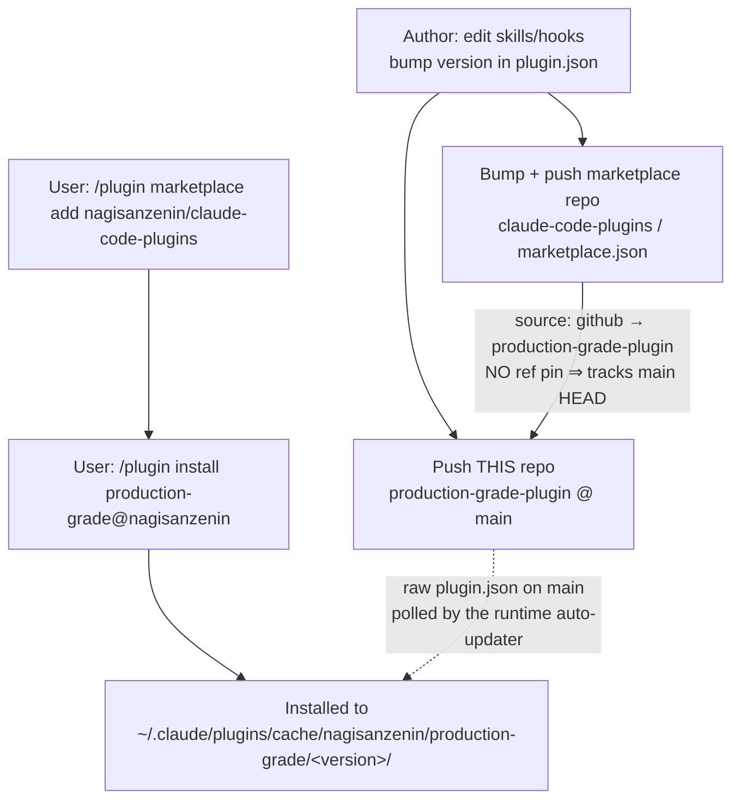

# Publishing Protocol

*How this plugin actually reaches users — the two-repo architecture, the release
runbook, and the versioning mechanics.*

This is the counterpart to [DEV_PROTOCOL.md](../DEV_PROTOCOL.md), which governs
*how we build*. This document governs *how we ship*. When the two overlap
(version bumping), DEV_PROTOCOL is the source of truth for the checklist; this
document explains the machinery underneath it and the exact publish steps.

> House style: no emoji. Unicode symbols and tables only (DEV_PROTOCOL §9).

---

## 1. The Two-Repo Architecture

This plugin ships through **two** GitHub repositories. Neither uses git tags,
GitHub Releases, or CI — everything is driven by files on the `main` branch.

| Repo | Role | Key file |
|------|------|----------|
| **`nagisanzenin/claude-code-production-grade-plugin`** (this repo) | The plugin itself — skills, hooks, protocols. | `.claude-plugin/plugin.json` |
| **`nagisanzenin/claude-code-plugins`** | The **marketplace** — the catalog Claude Code reads to discover and install the plugin. | `.claude-plugin/marketplace.json` |



### How the marketplace points at this repo

`nagisanzenin/claude-code-plugins/.claude-plugin/marketplace.json`:

```json
{
  "name": "nagisanzenin",
  "owner": { "name": "Quan Duong" },
  "plugins": [
    {
      "name": "production-grade",
      "source": { "source": "github", "repo": "nagisanzenin/claude-code-production-grade-plugin" },
      "description": "14 AI agents for all software engineering work. ...",
      "version": "5.4.0"
    }
  ]
}
```

Two things to internalize:

1. **The marketplace name is `nagisanzenin`.** That is the `@nagisanzenin` suffix
   users type in `production-grade@nagisanzenin`. It comes from the top-level
   `name` field of `marketplace.json`, *not* from the GitHub org.
2. **The `source` has no `ref`/`sha`/`branch`.** So installs resolve the plugin
   repo's **default branch (`main`) HEAD**. The `"version": "5.4.0"` sitting next
   to `source` is **catalog metadata used to gate updates** — it is not a git
   checkout target.

---

## 2. How Versioning Works Here

There are no tags and no CI. The version is a **hand-edited JSON string** that
must be kept in sync across several files (see the checklist in
[DEV_PROTOCOL.md §4](../DEV_PROTOCOL.md#4-development-workflow)).

### Version resolution precedence (Claude Code built-in)

When Claude Code decides what version a plugin is, it uses, in order:

1. `version` in the plugin's `plugin.json`  ← **authoritative for this plugin**
2. `version` in the marketplace entry
3. The git commit SHA of the source (if no explicit version)
4. `unknown`

Here (1) and (2) are both `5.4.0`, and they agree. **(1) wins**, so
`plugin.json` on `main` is the single source of truth for "what version is this".

### What triggers an update for users

| Version style | Update fires when… |
|---------------|--------------------|
| **Explicit `version`** (what we use) | The version **string changes**. Pushing commits to `main` **without** bumping the string does **not** propagate to users. |
| Git commit SHA (no `version` field) | Every commit is a new version. (We do **not** use this.) |

**Consequence — the golden rule of shipping here:**

> Any change you want users to receive **must** bump `version` in `plugin.json`.
> A commit to `main` with no version bump is invisible to installed users.

### Two update paths exist (know the difference)

- **Claude Code's built-in updater** — `/plugin marketplace update nagisanzenin`
  (or auto-update if enabled) re-reads the marketplace and re-installs when the
  version string changed.
- **This plugin's own runtime auto-updater** — `skills/production-grade/SKILL.md`
  (§ "Auto-Update Check") runs at the start of every pipeline. It reads the local
  version from `~/.claude/plugins/installed_plugins.json`, `WebFetch`es
  `raw.githubusercontent.com/.../main/.claude-plugin/plugin.json`, and if
  `remote > local` it prompts, `git clone`s `main` into the cache, rewrites
  `installed_plugins.json`, and asks the user to re-invoke. This is bespoke logic
  layered on top of Claude Code — it also keys off the `plugin.json` version on
  `main`, so the golden rule above still holds.

---

## 3. Release Runbook

The canonical procedure to cut and publish a new version. Steps 1–5 follow
[DEV_PROTOCOL.md §4](../DEV_PROTOCOL.md#4-development-workflow); steps 6–9 are the
publish half.

1. **Make the change** in this repo (skills, protocols, hooks). Read before you
   edit; respect the architecture rules in DEV_PROTOCOL §2.
2. **Decide the bump** (DEV_PROTOCOL §4 policy): patch = bugfix/wording,
   minor = new skill/protocol/mode, major = breaking structure/protocol change.
3. **Bump `version` in every place it lives.** All must match:

   | # | Location | Field |
   |---|----------|-------|
   | 1 | This repo: `.claude-plugin/plugin.json` | `version` |
   | 2 | Marketplace repo `nagisanzenin/claude-code-plugins`: `.claude-plugin/marketplace.json` | `plugins[0].version` |
   | 3 | Local `~/.claude/plugins/installed_plugins.json` | the `production-grade@nagisanzenin` entry |
   | 4 | Local cache dir `~/.claude/plugins/cache/nagisanzenin/production-grade/<version>/` | directory name |

   > Note: DEV_PROTOCOL §4 lists location #2 as a local path
   > (`~/nagi_plugins/nagisanzenin-plugins/...`). That is a *local working copy*
   > of the marketplace repo; the **published** source of truth is
   > `nagisanzenin/claude-code-plugins` on GitHub. Both must end up in sync.

4. **Update `CHANGELOG.md`** — what changed / added / fixed.
5. **Update `README.md`** (this repo) if user-visible behavior changed.
6. **Validate** both manifests before pushing:

   ```bash
   claude plugin validate .            # from this repo root
   claude plugin validate .            # from the marketplace repo root
   ```

7. **Test locally without publishing** (see §4).
8. **Commit and push THIS repo to `main`.**
9. **Commit and push the marketplace repo** (`claude-code-plugins`) with the
   matching `plugins[0].version`.

   > Both pushes are required. This repo carries the code; the marketplace repo
   > carries the version that Claude Code's updater compares against. If the two
   > disagree, the built-in updater and the runtime auto-updater can behave
   > inconsistently.

There is no "publish" button beyond these pushes — install resolves `main` HEAD.

---

## 4. Validate and Test Before Publishing

| Goal | Command |
|------|---------|
| Lint manifests / schema / naming / path-traversal | `claude plugin validate <path>` (add `--strict` to fail on warnings) |
| Load this plugin for one session, no install | `claude --plugin-dir ./` (from repo root) |
| Reload after edits mid-session | `/reload-plugins` |
| Inspect what a plugin will install | `claude plugin details production-grade@nagisanzenin` |
| List installed plugins | `claude plugin list` |

Recommended pre-publish loop: `validate` → `--plugin-dir` a scratch session →
exercise the orchestrator (`/production-grade`) and the SessionStart hook →
`/reload-plugins` after fixes.

---

## 5. How Users Install (Consume Flow)

From the marketplace `README.md`:

```
/plugin marketplace add nagisanzenin/claude-code-plugins
/plugin install production-grade@nagisanzenin
```

Auto-install for a whole project — add to `.claude/settings.json`:

```json
{
  "extraKnownMarketplaces": {
    "nagisanzenin": {
      "source": { "source": "github", "repo": "nagisanzenin/claude-code-plugins" }
    }
  },
  "enabledPlugins": { "production-grade@nagisanzenin": true }
}
```

Installed plugins land at
`~/.claude/plugins/cache/nagisanzenin/production-grade/<version>/`. That versioned
directory is what `${CLAUDE_PLUGIN_ROOT}` resolves to at runtime, and it is why
`hooks/hooks.json` must resolve the versioned path (not the unversioned parent)
in its fallback.

---

## 6. Manifest Field Reference (subset we use)

### `.claude-plugin/plugin.json` (this repo)

| Field | Required | Notes |
|-------|----------|-------|
| `name` | yes | kebab-case id (`production-grade`). Namespaces all components. |
| `version` | no* | Semantic version string. *Effectively required here* — it gates updates. Omit it and every commit becomes a new version. |
| `description` | no | Shown in the `/plugin` catalog. |
| `author` | no | `{ "name": "nagisanzenin" }`. |
| `license` | no | SPDX id (`MIT`). |
| `keywords` | no | Discovery tags. |

Auto-discovered directories at the plugin **root** (never inside
`.claude-plugin/`): `skills/`, `hooks/` (and `commands/`, `agents/`,
`.mcp.json`, etc. when present). This plugin ships its "14 agents" as
`skills/<name>/SKILL.md` — there is intentionally **no** `commands/` or
`agents/` directory.

### `.claude-plugin/marketplace.json` (marketplace repo)

| Field | Required | Notes |
|-------|----------|-------|
| `name` | yes | Marketplace id → the `@nagisanzenin` suffix. |
| `owner` | yes | `{ "name": "Quan Duong" }`. |
| `plugins[]` | yes | One entry per plugin. |
| `plugins[].name` | yes | `production-grade`. |
| `plugins[].source` | yes | `{ "source": "github", "repo": "…" }`. No `ref` ⇒ tracks `main`. |
| `plugins[].version` | no | Catalog/update-gating metadata; keep equal to `plugin.json`. |

To **pin** a release instead of tracking `main`, add a `ref` (tag/branch) or
`sha` to `source` — e.g. `{ "source": "github", "repo": "…", "sha": "<40-char>" }`.
We currently do not pin.

---

## 7. Known Drift to Reconcile

Caught during an audit of the two repos (2026-07). Not yet fixed:

- **Marketplace `README.md`** plugin table still lists `production-grade | 3.3.0`,
  while both manifests and the installed copy are `5.4.0`. The README table is
  stale; the manifests are correct.
- **DEV_PROTOCOL.md §4** references the marketplace manifest by a local path
  (`~/nagi_plugins/nagisanzenin-plugins/.claude-plugin/marketplace.json`). That
  is machine-specific; the portable reference is the `claude-code-plugins` repo.

Because version syncing is manual across two repos with no CI, a lightweight
pre-publish check (assert `plugin.json.version == marketplace.plugins[0].version`
and update the README table) would prevent this class of drift.

---

## 8. Quick Reference

```
Publish a new version:
  1. edit code in this repo
  2. bump version in: plugin.json, marketplace.json (claude-code-plugins),
     installed_plugins.json, cache dir name
  3. update CHANGELOG.md (+ README.md if user-visible)
  4. claude plugin validate .        (both repos)
  5. claude --plugin-dir ./          (smoke test) + /reload-plugins
  6. push THIS repo (main) AND the marketplace repo (main)

Install:      /plugin marketplace add nagisanzenin/claude-code-plugins
              /plugin install production-grade@nagisanzenin
Update:       /plugin marketplace update nagisanzenin
Golden rule:  no version bump ⇒ users see nothing. Bump plugin.json every ship.
```
