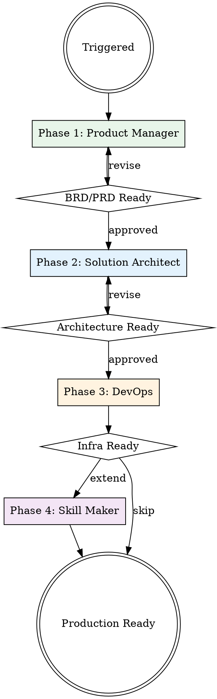

# Production Grade

## Overview

Meta-skill orchestrator that runs the full production pipeline: Product Manager → Solution Architect → DevOps → Skill Maker. Invokes each specialized skill in sequence, passing context forward, to take a project from idea to deployment-ready codebase — then offers to create custom project-specific skills for easy extension.

## When to Use

- Starting a new SaaS product or platform from scratch
- Building a complete production-ready system end-to-end
- When you need business requirements AND architecture AND DevOps together
- Greenfield projects that need the full treatment

## Orchestration Flow



## How It Works

This skill orchestrates four independent skills in sequence. **Each skill must be installed separately.** The orchestrator invokes them via the Skill tool and passes context between phases.

### Prerequisites

All four sub-skills must be available:
1. **product-manager** — Business requirements, BRD/PRD generation
2. **solution-architect** — System design, tech stack, API contracts, scaffolding
3. **devops** — Infrastructure, CI/CD, containers, monitoring, security
4. **skill-maker** — Custom skill creation for project-specific workflows

### Phase 1: Product Manager

Invoke the `product-manager` skill. This phase:
- Interviews the user about the product vision and requirements
- Generates a BRD (Business Requirements Document)
- Gets CEO/stakeholder approval on the BRD

**Context passed forward:** The approved BRD becomes input for Phase 2. Read the BRD file and reference its requirements, user stories, and acceptance criteria.

### Phase 2: Solution Architect

Invoke the `solution-architect` skill. This phase:
- Uses the BRD from Phase 1 as discovery input (skip redundant interview questions already answered in the BRD)
- Designs system architecture, selects tech stack
- Creates API contracts and data models
- Scaffolds the project structure

**Output:** `SolutionArchitect-Suite/` in project root

**Context passed forward:** The architecture docs, tech stack, and scaffold structure inform Phase 3's infrastructure decisions.

### Phase 3: DevOps

Invoke the `devops` skill. This phase:
- Uses architecture decisions from Phase 2 (skip redundant assessment questions)
- Generates Terraform IaC matching the designed architecture
- Creates CI/CD pipelines for the scaffolded services
- Configures monitoring for the defined SLOs
- Sets up security scanning and policies

**Output:** `DevOps-Suite/` in project root

### Phase 4: Skill Maker (Optional — Recommended)

After the core pipeline completes, offer to create project-specific custom skills. Invoke the `skill-maker` skill. This phase:
- Analyzes the generated architecture, tech stack, and DevOps setup
- Suggests 2-3 custom skills tailored to the project (e.g., "add-microservice", "deploy-to-staging", "onboard-developer")
- Creates skills that encode the project's conventions so future work stays consistent

**Suggested project-specific skills to offer:**

| Suggested Skill | Purpose |
|----------------|---------|
| `add-service` | Scaffold a new microservice following the project's architecture patterns, auto-wiring into CI/CD and monitoring |
| `add-api-endpoint` | Generate OpenAPI spec, handler, tests, and DB migration for a new endpoint following project conventions |
| `deploy` | Run the project's specific deployment workflow (Terraform plan/apply, K8s rollout, smoke tests) |
| `onboard-dev` | Guide new developers through project setup, architecture overview, and local dev environment |
| `incident-response` | Walk through the project's incident playbook with pre-filled service names and runbook links |

Ask the user which skills they'd like to create (or suggest their own), then invoke `skill-maker` for each.

## Execution Protocol

When this skill is triggered:

1. **Check prerequisites** — Verify all three sub-skills are available. If any are missing, inform the user:
   ```
   Missing skills: [list]. Install via:
   /plugin install <skill-name>@nagisanzenin
   ```

2. **Announce the pipeline:**
   ```
   Starting Production Grade pipeline:
   Phase 1: Product Manager → BRD/PRD
   Phase 2: Solution Architect → SolutionArchitect-Suite/
   Phase 3: DevOps → DevOps-Suite/
   Phase 4: Skill Maker → Custom project skills (optional)
   ```

3. **Execute sequentially** — Use the Skill tool to invoke each skill:
   - `Skill: product-manager`
   - Wait for BRD approval
   - `Skill: solution-architect` (reference the BRD in your discovery answers)
   - Wait for architecture approval
   - `Skill: devops` (reference the architecture docs in your assessment answers)
   - Wait for DevOps completion
   - Ask user if they want custom project skills → `Skill: skill-maker` for each

4. **Final summary** — After all phases complete, present:
   ```
   Production Grade Pipeline Complete:
   ├── BRD/PRD: <path to BRD>
   ├── SolutionArchitect-Suite/
   │   ├── docs/ (ADRs, diagrams, tech stack)
   │   ├── api/ (OpenAPI, gRPC, AsyncAPI specs)
   │   ├── schemas/ (ERD, migrations)
   │   └── scaffold/ (project structure)
   ├── DevOps-Suite/
   │   ├── terraform/ (multi-cloud IaC)
   │   ├── ci-cd/ (pipelines, deployment scripts)
   │   ├── containers/ (Docker, K8s, Helm)
   │   ├── monitoring/ (Prometheus, Grafana, OTel)
   │   └── security/ (scanning, IAM, compliance)
   └── Custom Skills (if created)
       └── <project-specific skills installed locally>
   ```

## Context Bridging Rules

To avoid redundant interviews across phases:

| If Phase 1 (PM) already answered... | Phase 2 (Architect) skips... |
|--------------------------------------|------------------------------|
| Product scope, users, B2B/B2C | Discovery question 1 |
| Scale targets in BRD | Discovery question 2 |
| Compliance requirements | Discovery question 3 |
| Integration requirements | Discovery question 4 |

| If Phase 2 (Architect) already decided... | Phase 3 (DevOps) skips... |
|---------------------------------------------|---------------------------|
| Tech stack, language, framework | Assessment question 2 |
| Scale requirements, regions | Assessment question 3 |
| Environment strategy in ADRs | Assessment question 4 |

## Partial Execution

Users can run individual phases:
- "Just the architecture" → invoke `solution-architect` only
- "Just DevOps" → invoke `devops` only
- "Skip PM, start from architecture" → skip Phase 1, start at Phase 2

If starting from Phase 2 or 3 without prior phases, the skill will run its own interview to gather missing context.

## Common Mistakes

| Mistake | Fix |
|---------|-----|
| Running DevOps before architecture | Architecture decisions determine infrastructure. Always architect first. |
| Skipping PM phase for "simple" projects | Even simple projects benefit from a clear BRD. Requirements drift kills projects. |
| Not passing context between phases | Read previous phase outputs and reference them. Don't re-ask answered questions. |
| Running all phases without approval gates | Each phase needs user approval before proceeding to the next. |
