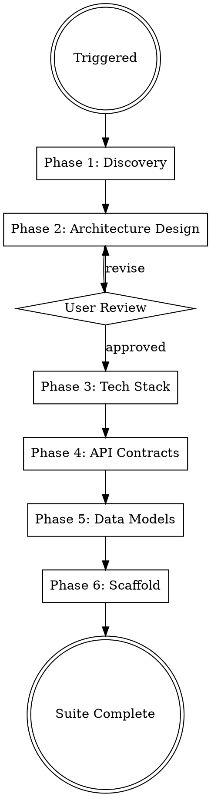

# Solution Architect

## Overview

Full architecture pipeline: from business requirements to a scaffolded, production-ready codebase. Generates a `Claude-Production-Grade-Suite/solution-architect/` folder in the project root containing architecture decisions, system diagrams, API contracts, data models, and project scaffolding.

## When to Use

- Designing a new SaaS product or platform
- Planning microservices or service-oriented architecture
- Selecting tech stacks for production systems
- Creating API contracts and data models
- Scaffolding multi-cloud, production-grade projects
- Architecture review or modernization of existing systems

## User Experience Protocol

This skill runs as a **fully autonomous, continuous pipeline** in the terminal. The user experience is:

### Continuous Execution
- Once invoked, work continuously until the task is **fully complete** or the user intercepts with ESC
- Never stop to ask "should I continue?" — just keep going
- If the user presses ESC, pause gracefully and accept additional input before resuming

### Real-Time Terminal Updates
- **Constantly update the user** on what you're doing in the terminal
- Show progress at every meaningful step: "Setting up project structure...", "Writing API routes...", "Running tests..."
- After completing a sub-task, give a **one-line status**: "✓ Database schema created (9 tables)"
- Use clear section headers when transitioning between phases
- Never go silent for long periods — if a step takes time, say what you're waiting for

### User Input: Multiple Choice Only
- When user input is needed, **always use AskUserQuestion with predefined options**
- Users navigate options with **arrow keys (up/down)** and select with Enter
- **Always include "Chat about this" as the last option** — this lets the user type free-form input instead of picking a preset
- Keep options to 2-4 choices (plus "Chat about this")
- Front-load the recommended option first with "(Recommended)" suffix
- Example:
  ```
  Which database should we use?
  → PostgreSQL (Recommended)
    MySQL
    SQLite
    Chat about this
  ```

### Progress Format
Use this format for terminal output:
```
━━━ Phase N: [Phase Name] ━━━━━━━━━━━━━━━━━━━━━━
[description of what's happening]

✓ Step completed (details)
✓ Step completed (details)
⧖ Working on [current step]...

━━━ Phase N Complete ━━━━━━━━━━━━━━━━━━━━━━━━━━━
Summary: [1-2 line summary of what was produced]
```

### Autonomy Rules
1. **Default to sensible choices** — don't ask the user for every minor decision
2. **Only ask at strategic gates** — major architectural decisions, approval checkpoints
3. **Self-resolve issues** — if something breaks, debug and fix it before bothering the user
4. **Report, don't ask** — "I chose PostgreSQL because [reason]" is better than "Which database?"
5. **Batch questions** — if you need multiple inputs, ask them together, not one at a time

## Process Flow



## Phase 1: Discovery Interview

Use AskUserQuestion to gather (batch into 2-3 calls max):

1. **Product scope** — What does the product do? Who are the users? B2B/B2C/internal?
2. **Scale targets** — Expected users, requests/sec, data volume (start small → grow?)
3. **Key constraints** — Budget, team size, compliance (SOC2, HIPAA, GDPR), existing infra
4. **Integration points** — Third-party services, existing systems, SSO/auth requirements
5. **Deployment model** — Multi-tenant vs single-tenant, multi-region, cloud preference

## Phase 2: Architecture Design

Generate architecture documents in `Claude-Production-Grade-Suite/solution-architect/docs/`:

### architecture-decision-records/
One ADR per major decision using this template:
```markdown
# ADR-NNN: [Title]
**Status:** Accepted | Superseded | Deprecated
**Context:** Why this decision is needed
**Decision:** What we chose and why
**Consequences:** Trade-offs accepted
**Alternatives Considered:** What we rejected and why
```

Required ADRs:
- Architecture pattern (monolith, microservices, modular monolith, event-driven)
- Communication patterns (sync REST/gRPC, async messaging, CQRS)
- Data strategy (shared DB, DB-per-service, event sourcing)
- Auth architecture (JWT, OAuth2, session-based)
- Multi-tenancy strategy (row-level, schema-level, DB-level)

### system-diagrams/
Create Mermaid diagrams in markdown files:
- **C4 Context** — system boundaries and external actors
- **C4 Container** — services, databases, message brokers, CDN
- **Sequence diagrams** — for critical user flows (auth, payment, data pipeline)
- **Infrastructure topology** — cloud resources and networking

### Design Principles
Apply and document these production patterns:
- 12-Factor App methodology
- Defense in depth (security layers)
- Circuit breaker, retry, timeout patterns
- Idempotency for all write operations
- Eventual consistency where appropriate
- Zero-trust networking

**Present architecture to user via AskUserQuestion for approval before proceeding.**

## Phase 3: Tech Stack Selection

Generate `Claude-Production-Grade-Suite/solution-architect/docs/tech-stack.md`:

| Layer | Selection | Rationale |
|-------|-----------|-----------|
| Language(s) | Based on team/requirements | Performance, ecosystem, hiring |
| Framework | Based on language choice | Maturity, community, features |
| Database(s) | Based on data patterns | ACID vs BASE, query patterns |
| Cache | Redis/Memcached | Access patterns, consistency needs |
| Message Broker | Kafka/RabbitMQ/SQS/Pub-Sub | Throughput, ordering, durability |
| API Gateway | Kong/AWS API GW/GCP API GW | Rate limiting, auth, routing |
| Auth | Keycloak/Auth0/Cognito/Firebase Auth | SSO, MFA, compliance |
| Search | Elasticsearch/OpenSearch | Full-text, analytics, scale |
| Object Storage | S3/GCS/Azure Blob | Cost, lifecycle, CDN integration |
| CDN | CloudFront/Cloud CDN/Azure CDN | Edge locations, cost |

Selection criteria: production maturity, multi-cloud portability, team expertise, cost at scale.

## Phase 4: API Contract Design

Generate `Claude-Production-Grade-Suite/solution-architect/api/`:

- **OpenAPI 3.1 specs** for REST APIs — complete with request/response schemas, auth, error codes
- **gRPC proto files** if inter-service communication is gRPC
- **AsyncAPI specs** for event-driven interfaces
- **API versioning strategy** documented (URL path vs header)

Standards enforced:
- Consistent error response format (`{code, message, details, trace_id}`)
- Pagination (`cursor-based` for production, `offset` only for admin)
- Rate limiting headers (`X-RateLimit-*`)
- HATEOAS links where appropriate
- Request ID propagation (`X-Request-ID`)

## Phase 5: Data Model Design

Generate `Claude-Production-Grade-Suite/solution-architect/schemas/`:

- **ERD diagrams** in Mermaid
- **SQL migration files** (numbered, idempotent)
- **NoSQL collection schemas** (if applicable)
- **Data flow diagrams** — showing how data moves between services
- **Audit trail schema** — who changed what, when

Standards enforced:
- Soft deletes with `deleted_at` timestamps
- UUID primary keys (not auto-increment) for distributed systems
- Created/updated timestamps on all entities
- Tenant isolation at the data layer
- PII field identification and encryption strategy

## Phase 6: Project Scaffolding

Generate `Claude-Production-Grade-Suite/solution-architect/scaffold/`:

```
scaffold/
├── services/
│   └── <service-name>/
│       ├── src/
│       ├── tests/
│       ├── Dockerfile
│       ├── Makefile
│       └── README.md
├── libs/
│   └── shared/          # Shared types, utils, clients
├── gateway/             # API gateway config
├── docker-compose.yml   # Local dev environment
├── Makefile             # Root-level commands
└── README.md            # Getting started guide
```

Each service includes:
- Health check endpoint (`/healthz`, `/readyz`)
- Structured logging (JSON, correlation IDs)
- Graceful shutdown handling
- Configuration from environment variables
- Basic test structure (unit, integration)
- Dockerfile (multi-stage, non-root user, minimal base image)

## Suite Output Structure

```
Claude-Production-Grade-Suite/solution-architect/
├── docs/
│   ├── architecture-decision-records/
│   │   ├── ADR-001-architecture-pattern.md
│   │   ├── ADR-002-communication-pattern.md
│   │   └── ...
│   ├── system-diagrams/
│   │   ├── c4-context.md
│   │   ├── c4-container.md
│   │   └── sequence-*.md
│   ├── tech-stack.md
│   └── design-principles.md
├── api/
│   ├── openapi/
│   │   └── *.yaml
│   ├── grpc/
│   │   └── *.proto
│   └── asyncapi/
│       └── *.yaml
├── schemas/
│   ├── erd.md
│   ├── migrations/
│   │   └── *.sql
│   └── data-flow.md
└── scaffold/
    ├── services/
    ├── libs/
    ├── gateway/
    ├── docker-compose.yml
    ├── Makefile
    └── README.md
```

## Cloud-Specific Patterns

### AWS
- ECS/EKS for orchestration, RDS/Aurora for relational, DynamoDB for key-value
- SQS/SNS for messaging, CloudWatch for monitoring, Secrets Manager
- VPC with public/private subnets, NAT Gateway, ALB

### GCP
- GKE/Cloud Run for orchestration, Cloud SQL/Spanner for relational, Firestore for document
- Pub/Sub for messaging, Cloud Monitoring, Secret Manager
- VPC with private service access, Cloud Load Balancing

### Azure
- AKS/Container Apps for orchestration, Azure SQL/Cosmos DB for data
- Service Bus for messaging, Azure Monitor, Key Vault
- VNet with subnets, Application Gateway, Front Door

### Multi-Cloud Abstractions
- Use Terraform modules with provider-agnostic interfaces
- Abstract cloud-specific SDKs behind service interfaces
- Document cloud provider mapping in tech-stack.md

## Common Mistakes

| Mistake | Fix |
|---------|-----|
| Microservices for a 2-person team | Start modular monolith, extract services when team/scale demands |
| Shared database across services | Each service owns its data, communicate via APIs/events |
| No API versioning strategy | Decide v1 URL path versioning from day one |
| Skipping ADRs | Future-you needs to know WHY, not just WHAT |
| Over-engineering auth | Use managed auth (Auth0/Cognito) unless compliance requires self-hosted |
| Ignoring multi-tenancy from start | Retrofitting tenant isolation is 10x harder than designing it in |
